# Execution Plan — YuvaMitra

## Detailed Analysis Summary

### Transformation Scope
- **Project Type**: Greenfield (no existing code; brownfield-only analysis is N/A).
- **Transformation Type**: New multi-component application.
- **Primary Changes**: Build a React 18 + TypeScript + Vite + Tailwind SPA, a thin Python/FastAPI backend proxy to Amazon Bedrock (boto3), a JSON data layer, an AI/agent layer, and a mocked MCP tool interface.
- **Related Components**: Frontend UI + AI-service client, FastAPI backend (AI/agent services + MCP interface), seed JSON data, i18n scaffolding.

### Change Impact Assessment
- **User-facing changes**: Yes — 7 core screens, chat, notifications, proactive agent cycle.
- **Structural changes**: Yes — new frontend/backend architecture from scratch.
- **Data model changes**: Yes — youth case JSON schema (profile, education, skills, goals, activities, milestones, tasks, journey, opportunities).
- **API changes**: Yes — new backend HTTP endpoints (assessment, gap analysis, roadmap, chat, agent cycle, health).
- **NFR impact**: Yes — Security (blocking), Resiliency (directional), Property-Based Testing (Partial).

### Component Relationships
- N/A (greenfield — no existing component dependency graph).

### Risk Assessment
- **Risk Level**: Medium — multiple new components and AI integration, but local-only demo with easy Git rollback and no production/cloud footprint.
- **Rollback Complexity**: Easy — revert Git commit (RESILIENCY-04).
- **Testing Complexity**: Moderate — PBT (Partial) on serialization round-trips and gap/prioritisation invariants; graceful-degradation paths.

## Workflow Visualization

### Mermaid Diagram

```mermaid
flowchart TD
    Start(["User Request"])

    subgraph INCEPTION["INCEPTION PHASE"]
        WD["Workspace Detection<br/><b>COMPLETED</b>"]
        RA["Requirements Analysis<br/><b>COMPLETED</b>"]
        US["User Stories<br/><b>COMPLETED</b>"]
        WP["Workflow Planning<br/><b>COMPLETED</b>"]
        AD["Application Design<br/><b>EXECUTE</b>"]
        UG["Units Generation<br/>(Planning + Generation)<br/><b>EXECUTE</b>"]
    end

    subgraph CONSTRUCTION["CONSTRUCTION PHASE"]
        FD["Functional Design<br/><b>EXECUTE</b>"]
        NFRA["NFR Requirements<br/><b>EXECUTE</b>"]
        NFRD["NFR Design<br/><b>EXECUTE</b>"]
        ID["Infrastructure Design<br/><b>SKIP</b>"]
        CG["Code Generation<br/>(Planning + Generation)<br/><b>EXECUTE</b>"]
        BT["Build and Test<br/><b>EXECUTE</b>"]
    end

    subgraph OPERATIONS["OPERATIONS PHASE"]
        OPS["Operations<br/><b>PLACEHOLDER</b>"]
    end

    Start --> WD
    WD --> RA
    RA --> US
    US --> WP
    WP --> AD
    AD --> UG
    UG --> FD
    FD --> NFRA
    NFRA --> NFRD
    NFRD --> ID
    ID --> CG
    CG --> BT
    BT --> OPS
    OPS --> End(["Complete"])

    style WD fill:#4CAF50,stroke:#1B5E20,stroke-width:3px,color:#fff
    style RA fill:#4CAF50,stroke:#1B5E20,stroke-width:3px,color:#fff
    style US fill:#4CAF50,stroke:#1B5E20,stroke-width:3px,color:#fff
    style WP fill:#4CAF50,stroke:#1B5E20,stroke-width:3px,color:#fff
    style AD fill:#FFA726,stroke:#E65100,stroke-width:3px,stroke-dasharray: 5 5,color:#000
    style UG fill:#FFA726,stroke:#E65100,stroke-width:3px,stroke-dasharray: 5 5,color:#000
    style FD fill:#FFA726,stroke:#E65100,stroke-width:3px,stroke-dasharray: 5 5,color:#000
    style NFRA fill:#FFA726,stroke:#E65100,stroke-width:3px,stroke-dasharray: 5 5,color:#000
    style NFRD fill:#FFA726,stroke:#E65100,stroke-width:3px,stroke-dasharray: 5 5,color:#000
    style ID fill:#BDBDBD,stroke:#424242,stroke-width:2px,stroke-dasharray: 5 5,color:#000
    style CG fill:#4CAF50,stroke:#1B5E20,stroke-width:3px,color:#fff
    style BT fill:#4CAF50,stroke:#1B5E20,stroke-width:3px,color:#fff
    style OPS fill:#FFF59D,stroke:#F9A825,stroke-width:2px,color:#000
    style Start fill:#CE93D8,stroke:#6A1B9A,stroke-width:3px,color:#000
    style End fill:#CE93D8,stroke:#6A1B9A,stroke-width:3px,color:#000

    linkStyle default stroke:#333,stroke-width:2px
```



### Text Alternative (always included)

```
INCEPTION PHASE
- Workspace Detection ....... COMPLETED
- Requirements Analysis ..... COMPLETED
- User Stories .............. COMPLETED
- Workflow Planning ......... COMPLETED (current)
- Application Design ........ EXECUTE
- Units Generation .......... EXECUTE

CONSTRUCTION PHASE (per unit)
- Functional Design ......... EXECUTE
- NFR Requirements .......... EXECUTE
- NFR Design ................ EXECUTE
- Infrastructure Design ..... SKIP (local demo, no cloud provisioning)
- Code Generation ........... EXECUTE (always)
- Build and Test ............ EXECUTE (always)

OPERATIONS PHASE
- Operations ................ PLACEHOLDER (future)
```

## Phases to Execute

### 🔵 INCEPTION PHASE
- [x] Workspace Detection (COMPLETED)
- [x] Reverse Engineering (SKIPPED — greenfield)
- [x] Requirements Analysis (COMPLETED)
- [x] User Stories (COMPLETED)
- [x] Execution Plan (IN PROGRESS)
- [ ] Application Design - EXECUTE
  - **Rationale**: New components across frontend (screens + AI-service client) and backend (AI/agent services, MCP tool interface, data-access utilities) need responsibilities, methods, and boundaries defined.
- [ ] Units Generation - EXECUTE
  - **Rationale**: The system decomposes into distinct units (frontend SPA, FastAPI backend/AI-agent, MCP interface, data layer) that benefit from structured breakdown.

### 🟢 CONSTRUCTION PHASE
- [ ] Functional Design - EXECUTE
  - **Rationale**: A youth-case JSON data model and non-trivial agent-cycle business logic (detection of progress/opportunities/deadlines/inactivity, gap analysis, prioritisation) need detailed design.
- [ ] NFR Requirements - EXECUTE
  - **Rationale**: Security baseline is enabled and blocking; Resiliency and PBT are enabled — tech-stack and NFR targets must be captured per unit.
- [ ] NFR Design - EXECUTE
  - **Rationale**: NFR patterns (server-side credentials, input validation, CORS, timeouts, graceful degradation, health check, PBT properties) must be incorporated into the design.
- [ ] Infrastructure Design - SKIP
  - **Rationale**: Confirmed local demo only this iteration (Q9=A, Q4/Q6 resiliency = local/no CI-CD). No cloud resources to provision; a production build remains static-host-capable for the future.
- [ ] Code Generation - EXECUTE (ALWAYS)
  - **Rationale**: Implementation planning and code generation for all units.
- [ ] Build and Test - EXECUTE (ALWAYS)
  - **Rationale**: Build, unit/integration tests (incl. PBT Partial), and verification.

### 🟡 OPERATIONS PHASE
- [ ] Operations - PLACEHOLDER
  - **Rationale**: Future deployment and monitoring workflows; out of scope this iteration.

## Package Change Sequence
- N/A (greenfield — no existing packages to sequence). Unit build order will be defined during Units Generation.

## Estimated Timeline
- **Total Stages to Execute**: 8 (Application Design, Units Generation, Functional Design, NFR Requirements, NFR Design, Code Generation, Build and Test) + Operations placeholder.
- **Estimated Duration**: Workshop-scale — proceed stage by stage with approval gates.

## Success Criteria
- **Primary Goal**: A locally runnable YuvaMitra demo — React/Vite frontend + Python/FastAPI backend calling Amazon Bedrock — delivering the 7 core screens, chat, notifications, and the proactive agent cycle.
- **Key Deliverables**: Frontend SPA, FastAPI backend proxy, youth-case JSON seed data, AI/agent services, mocked MCP tool interface, i18n scaffolding.
- **Quality Gates**: Security baseline satisfied (no client-side secrets, server-side Bedrock credentials, input validation, restrictive CORS, fail-closed errors); graceful degradation when AI backend is unavailable; PBT (Partial) properties pass; frontend builds and backend runs locally.
